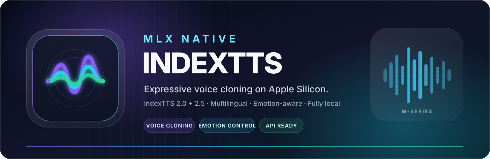
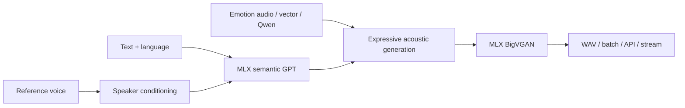

<p align="center">
  
</p>

<p align="center">
  <a href="https://github.com/groxaxo/mlx-indextts2-inference"></a>
  <a href="https://github.com/ml-explore/mlx"></a>
  <a href="https://github.com/index-tts/index-tts"></a>
  
  <a href="LICENSE"></a>
</p>

<p align="center">
  <strong>Expressive, multilingual voice cloning—fully local on your Mac.</strong><br />
  Native MLX inference for IndexTTS 2.0 and 2.5 with independent emotion control,
  persistent quantization, batch generation, streaming, FastAPI, Gradio, and a clean Python API.
</p>

<p align="center">
  <a href="#quick-start">Quick start</a> ·
  <a href="#what-you-get">Features</a> ·
  <a href="#choose-your-interface">Interfaces</a> ·
  <a href="#model-profiles">Models</a> ·
  <a href="#performance">Performance</a> ·
  <a href="#documentation">Docs</a>
</p>

> [!NOTE]
> **IndexTTS 2.5 is the primary target.** IndexTTS 2.0 remains available for compatibility and the local Vietnamese profile. IndexTTS 1.5 is not maintained or part of the regression target.

## Why this project

| Native Apple Silicon | Voice **and** emotion control | Ready beyond the demo |
| --- | --- | --- |
| GPT, codec, S2Mel/DiT, and BigVGAN inference run through MLX instead of hiding a PyTorch backend behind a wrapper. | Clone a speaker from a short reference while steering delivery from emotion audio, named/mixed vectors, or Qwen text analysis. | Use the same runtime through CLI, Python, batch jobs, FastAPI, Gradio, and completed-segment streaming. |

The result is a practical local speech stack for narration, dubbing, character voices, accessibility, prototyping, and private on-device workflows.

## What you get

- **Zero-shot voice cloning** from a WAV reference or a reusable, version-safe `.npz` speaker cache.
- **IndexTTS 2.5 multilingual synthesis** in Chinese, English, Japanese, Spanish, and Arabic.
- **Cross-lingual voice transfer** with explicit language routing.
- **Disentangled emotion control** using emotion audio, eight-value vectors, named/mixed emotions, or Qwen text analysis.
- **Pronunciation guidance** for Chinese Pinyin, English CMU phonemes, and Japanese Kana.
- **Persistent GPT quantization** at 3, 4, 5, 6, or 8 bits, plus fp16/fp32 conversion.
- **Model-resident batch generation** with manifests, combined WAV output, duration controls, and per-row settings.
- **FastAPI + Gradio + Python API** backed by a shared single-model cache.
- **Completed-segment streaming** for safer progressive output without pretending to provide token-level waveform streaming.
- **Local extensions** for Vietnamese, emotion-reference libraries, scene planning, and subtitle-oriented duration fitting.

## Quick start

### Requirements

- macOS on an Apple Silicon Mac
- Python 3.10 or newer
- [`uv`](https://docs.astral.sh/uv/)
- Enough unified memory for the model/dtype you choose

### 1. Install

```bash
curl -LsSf https://astral.sh/uv/install.sh | sh

git clone https://github.com/groxaxo/mlx-indextts2-inference.git
cd mlx-indextts2-inference

# Core IndexTTS 2.5 runtime
uv sync --extra v25
```

For every local interface in one environment:

```bash
uv sync --extra v25 --extra qwen --extra api --extra webui
```

### 2. Download and convert IndexTTS 2.5

```bash
uv run hf download IndexTeam/IndexTTS-2.5 \
  --revision d0aa86e75bb6f3437f3831e95056fa72842d89ef \
  --local-dir models/IndexTTS-2.5-source

uv run mlx-indextts convert \
  --model-dir models/IndexTTS-2.5-source \
  --output models/mlx-IndexTTS-2.5-8bit \
  --dtype float16 \
  --quantize 8 \
  --source-revision d0aa86e75bb6f3437f3831e95056fa72842d89ef
```

The converter validates tensor coverage, stages output resumably, and publishes the converted model atomically. See the [full 2.5 conversion guide](docs/indextts-2.5.md#download-and-convert) for fp16/fp32 and other quantization levels.

### 3. Clone a voice

Use a clean speech reference, ideally with one speaker and little background noise.

```bash
uv run mlx-indextts generate \
  --profile v25 \
  --language en \
  --ref-audio reference.wav \
  --text "Hello from a fully local IndexTTS voice running on Apple Silicon." \
  --output output.wav
```

The default v2.5 model path is `models/mlx-IndexTTS-2.5-8bit`. Override it with `--model` or `MLX_INDEXTTS_V25_MODEL`.

### 4. Add expression

Named and mixed emotions work without loading Qwen:

```bash
uv run mlx-indextts generate \
  --profile v25 \
  --language en \
  --ref-audio reference.wav \
  --text "I cannot believe we finally made it." \
  --emotion "happy:0.75,calm:0.25" \
  --emo-alpha 0.65 \
  --output expressive.wav
```

Or let the local Qwen emotion model interpret an independent direction:

```bash
uv sync --extra qwen
uv run python scripts/convert_qwen_emotion_mlx.py

uv run mlx-indextts generate \
  --profile v25 \
  --language en \
  --ref-audio reference.wav \
  --text "You came back." \
  --emotion-text "Relieved and warm, with restrained excitement." \
  --output directed.wav
```

## Faster repeated inference

Pre-compute speaker conditioning once, then reuse it without reprocessing the source audio:

```bash
uv run mlx-indextts speaker \
  --profile v25 \
  --ref-audio reference.wav \
  --output speakers/my_voice_v25.npz

uv run mlx-indextts generate \
  --profile v25 \
  --language es \
  --ref-audio speakers/my_voice_v25.npz \
  --text "Hola, esta voz ya está preparada para inferencia repetida." \
  --output output_es.wav
```

> [!IMPORTANT]
> IndexTTS 2.0 and 2.5 speaker caches are intentionally incompatible. The 2.5 cache stores its schema, source revision, preprocessing metadata, tensor shapes, and reference-audio hash.

## Choose your interface

| Interface | Start here | Best for |
| --- | --- | --- |
| **CLI** | `uv run mlx-indextts generate --help` | Scripts, experiments, and one-off generation |
| **Python** | `from mlx_indextts import IndexTTSv25` | Applications and custom pipelines |
| **Batch** | `uv run mlx-indextts batch ...` | Books, dialogue, datasets, and subtitle rows |
| **FastAPI** | `uv run mlx-indextts-api` | Local services and app integrations |
| **Gradio** | `uv run mlx-indextts-webui` | Interactive testing and creative iteration |
| **Streaming** | `POST /generate/stream` or `--stream` | Progressive completed-segment delivery |

### Python API

```python
from mlx_indextts import IndexTTSv25

model = IndexTTSv25("models/mlx-IndexTTS-2.5-8bit")
model.generate(
    text="Hola, esta es una prueba.",
    reference_audio="speakers/my_voice_v25.npz",
    output_path="output_es.wav",
    language="es",
    emotion="calm",
)
```

### Batch generation

Input may be a text file with one utterance per line or a CSV containing a `text` column. CSV rows can also override language, speaker/emotion references, token budgets, and duration controls.

```bash
uv run mlx-indextts batch \
  --input dialogue.csv \
  --ref-audio speakers/my_voice_v25.npz \
  --output-dir outputs/dialogue \
  --profile v25 \
  --auto-emotion \
  --combine
```

Each run writes individual WAV files and `manifest.csv`; `--combine` also produces `combined.wav`. The model stays resident across the batch.

### Local API

```bash
uv sync --extra api
uv run mlx-indextts-api
```

Core endpoints:

- `GET /health`
- `GET /profiles`
- `POST /generate`
- `POST /generate/stream`
- `POST /speaker`
- `POST /batch`
- `POST /plan`
- `GET /audio`

```bash
curl -X POST http://127.0.0.1:7862/generate \
  -H 'content-type: application/json' \
  -d '{
    "text": "Hola, esta es una prueba.",
    "ref_audio": "speakers/my_voice_v25.npz",
    "profile": "v25",
    "language": "es",
    "output_path": "outputs/api_es.wav"
  }'
```

### WebUI

```bash
uv sync --extra webui
uv run mlx-indextts-webui
```

The Gradio UI exposes profile/language selection, pronunciation guidance, emotion modes, normalization and duration controls, and completed-segment progress through the same cached runtime.

## Model profiles

| Profile | Languages | Highlights |
| --- | --- | --- |
| **IndexTTS 2.5** (`v25`) | Chinese, English, Japanese, Spanish, Arabic | Primary path; multilingual transfer, pronunciation annotations, independent emotion text, streaming, revision-safe caches |
| **IndexTTS 2.0 standard** (`standard`) | Chinese and English | Preserved compatibility path with the shared emotion controls |
| **IndexTTS 2.0 Vietnamese** (`vietnamese`) | Vietnamese | Local extension with automatic Vietnamese routing when tone marks are detected |

Default local paths:

```text
models/mlx-IndexTTS-2.5-8bit
models/mlx-indexTTS2-standard-8bit
models/mlx-indexTTS2-vietnamese-8bit
```

Override them with:

```bash
export MLX_INDEXTTS_V25_MODEL=/path/to/mlx-v25
export MLX_INDEXTTS_STANDARD_MODEL=/path/to/mlx-v20
export MLX_INDEXTTS_VIETNAMESE_MODEL=/path/to/mlx-vietnamese
```

## Quantization

Persistent conversion supports fp32, fp16, and 3/4/5/6/8-bit GPT weights. The codec, S2Mel/DiT, and BigVGAN components retain the selected conversion dtype; quantization is not misrepresented as an all-component conversion.

**8-bit is the recommended starting point** for a strong balance of footprint, quality, and speed. Reproduce and compare variants with the [quantized-model guide](docs/quantized-models.md).

## Simplified data flow



## Advanced workflows

| Workflow | Command | Output |
| --- | --- | --- |
| Emotion reference library | `mlx-indextts emotion2vec` | Tagged clips, catalog, emotion lookup JSON, summary |
| Video/YouTube scene library | `mlx-indextts video-library` | Speech clips tagged by scene, emotion, gender, and age band |
| Dialogue planner | `mlx-indextts plan` | Batch CSV with speaker and emotion references filled in |
| Subtitle alignment | `target_duration` + `fit_duration` | Natural generation plus explicit pitch-preserving time fitting |
| Reference cleanup | Default denoising or `--no-denoise-ref` | Cleaner speaker conditioning for noisy sources |

Install the relevant optional groups only when needed:

```bash
uv sync --extra emotion2vec
uv sync --extra library
uv sync --extra denoise
```

## Performance

Matched local validation on an M3 Max used the same references and texts, persistent 8-bit GPT models, 16 diffusion steps, and version-specific speaker caches. **RTF is real-time factor; lower is faster.**

| Metric | IndexTTS 2.0 | IndexTTS 2.5 |
| --- | ---: | ---: |
| Cold model load | 1.484 s | 0.226 s |
| Raw reference preprocessing | 10.837 s | 4.293 s |
| Warm Chinese RTF | 1.388 | 1.043 |
| Warm English RTF | 1.840 | 1.074 |
| Mean warm RTF | 1.614 | 1.059 |

These are environment- and sample-specific engineering measurements, not universal speed claims. See the [executed validation record](docs/indextts-2.5-validation.md) and [performance bottleneck analysis](docs/performance-bottlenecks.md) for methodology and caveats.

## Documentation

- **[IndexTTS 2.5 guide](docs/indextts-2.5.md)** — source revision, conversion, generation, pronunciation, emotion, duration, API, and validation.
- **[Validation record](docs/indextts-2.5-validation.md)** — executed parity and quality checks.
- **[Quantized models](docs/quantized-models.md)** — persistent quantization and benchmark reproduction.
- **[Performance bottlenecks](docs/performance-bottlenecks.md)** — profiling findings and optimized hot paths.

Useful discovery commands:

```bash
uv run mlx-indextts --help
uv run mlx-indextts generate --help
uv run mlx-indextts batch --help
```

## License and responsible use

Repository code is released under the [MIT License](LICENSE).

Official IndexTTS weights and converted/quantized derivatives are governed by the upstream **bilibili Model Use License Agreement**, including its commercial thresholds, downstream notice obligations, and use restrictions. Keep the upstream model license with every model copy.

Only clone voices you own or have explicit permission to use. Do not use this software for impersonation, deception, privacy infringement, unlawful content, or prohibited high-risk deployment. The model does not verify identity or consent for you.

## Acknowledgments

- [IndexTTS](https://github.com/index-tts/index-tts) — original PyTorch implementation and model family.
- [MLX](https://github.com/ml-explore/mlx) — Apple's array framework for Apple Silicon.

Contributions, reproducible benchmark results, and focused bug reports are welcome.
